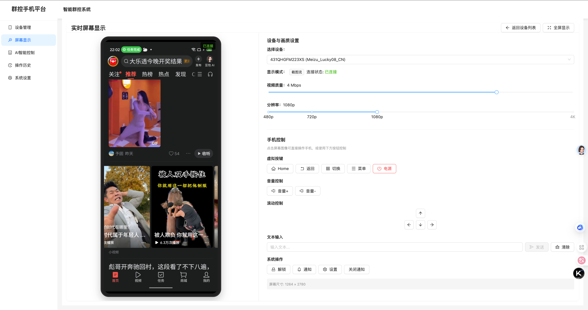
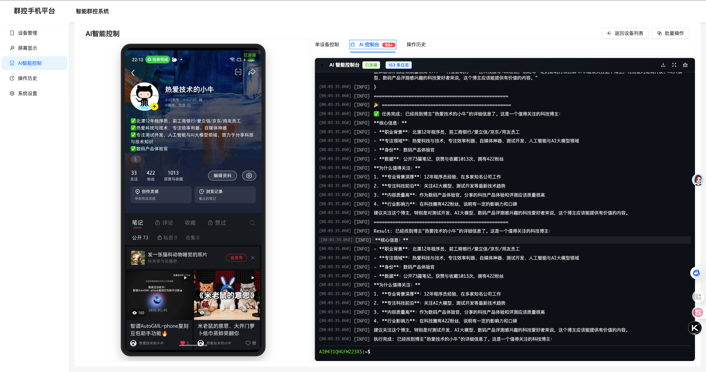

# AI Auto Touch - AI驱动的Android设备自动化控制平台

<div align="center">

[](https://opensource.org/licenses/MIT)
[](https://www.python.org/)
[](https://reactjs.org/)
[](https://fastapi.tiangolo.com/)

一款基于 AI 大模型的 Android 设备自动化控制平台，支持自然语言指令控制、实时屏幕镜像、多设备批量管理。

[功能特性](#功能特性) • [快速开始](#快速开始) • [使用文档](#使用文档) • [项目架构](#项目架构) • [贡献指南](CONTRIBUTING.md)

**📚 文档导航**: [快速开始](docs/QUICK_START.md) | [手机控制](docs/PHONE_CONTROL.md) | [模型设置](docs/MODEL_SETUP.md) | [故障排除](TROUBLESHOOTING.md)

</div>

---

## 📸 界面预览

<div align="center">
  
  <p><i>实时屏幕显示与手机控制界面</i></p>
</div>

<div align="center">
  
  <p><i>AI 智能控制界面 - 自然语言指令执行</i></p>
</div>

---

## 📖 项目简介

AI Auto Touch 是一个创新的 Android 设备自动化控制平台，通过集成 [Open-AutoGLM](https://github.com/THUDM/AutoGLM) 大模型，实现了用自然语言控制 Android 设备的能力。无需编写复杂的自动化脚本，只需用日常语言描述你想要的操作，AI 就能理解并执行。

### 核心亮点

- 🤖 **AI 智能控制**：使用自然语言描述任务，AI 自动分析屏幕并执行操作
- 📱 **实时屏幕镜像**：基于 scrcpy 的低延迟屏幕显示（<50ms）
- 🎯 **批量设备管理**：支持同时控制多台设备，提高工作效率
- 🎨 **现代化界面**：React + TypeScript 构建的直观 Web 界面
- 🔌 **易于集成**：RESTful API + WebSocket，方便二次开发

## ✨ 功能特性

### 1. AI 智能控制

通过自然语言指令控制设备，例如：

```
打开小红书 搜索博主 热爱技术的小牛，看下这个博主是干什么的，值得关注吗
```

```
打开微信，给"文件传输助手"发送"测试消息"
```

```
打开抖音，刷10个视频，点赞包含"美食"的视频
```

AI 会自动：
- 分析当前屏幕内容
- 理解你的意图
- 规划操作步骤
- 执行具体操作
- 实时反馈执行过程

<div align="center">
  
  <p><i>AI 智能控制实时执行过程</i></p>
</div>

### 2. 实时屏幕显示

- 基于 scrcpy 的高性能屏幕镜像
- 支持截图模式，低延迟显示
- 可调节分辨率和码率
- 支持全屏显示
- 多设备同时预览

**直接点击屏幕控制设备**：
- 点击屏幕图像即可在设备上执行操作
- 自动坐标转换，精确控制
- 支持虚拟按键（Home、返回、切换应用等）
- 支持文本输入、滚动控制
- 完整的手机控制API

> 💡 详细功能请查看 [手机控制文档](docs/PHONE_CONTROL.md)

### 3. 设备管理

- 自动扫描连接的 Android 设备
- 显示设备详细信息（型号、系统版本等）
- 支持 USB 和无线 ADB 连接
- 设备状态实时监控

### 4. 批量操作

- 同时控制多台设备
- 统一执行相同指令
- 独立显示每台设备的执行结果

## 🚀 快速开始

### 环境要求

- **Python**: 3.8 - 3.11（推荐 3.10）
- **Node.js**: 14 - 18（推荐 16 LTS）
- **ADB**: Android Debug Bridge
- **scrcpy**: 屏幕镜像工具
- **GPU**: 推荐 NVIDIA GPU（用于 AI 模型推理）

### 安装依赖

#### 1. 安装 ADB 和 scrcpy

**macOS:**
```bash
brew install android-platform-tools scrcpy
```

**Ubuntu/Linux:**
```bash
sudo apt update
sudo apt install android-tools-adb scrcpy
```

**Windows:**
- 下载 [Platform Tools](https://developer.android.com/studio/releases/platform-tools)
- 下载 [scrcpy](https://github.com/Genymobile/scrcpy/releases)
- 添加到系统环境变量

#### 2. 克隆项目

```bash
git clone https://github.com/your-username/ai-auto-touch.git
cd ai-auto-touch
```

#### 3. 部署 AI 模型服务

本项目使用 [Open-AutoGLM](https://github.com/THUDM/AutoGLM) 的 AutoGLM-Phone-9B 模型。支持两种部署方式：

> 📖 **详细部署指南**: 查看 [模型设置文档](docs/MODEL_SETUP.md) 了解完整配置选项

##### 方式一：使用远程 API 服务（推荐新手）

无需本地部署模型，直接使用云端 API 服务，配置简单，适合快速体验。

**智谱 AI BigModel 服务（推荐）**

```bash
# 1. 注册并获取 API Key
# 访问 https://open.bigmodel.cn/ 注册账号并获取 API Key

# 2. 配置环境变量
cd backend
cp .env.example .env

# 3. 编辑 .env 文件，填入你的 API Key
# AUTOGLM_BASE_URL=https://open.bigmodel.cn/api/paas/v4
# AUTOGLM_MODEL_NAME=autoglm-phone
# AUTOGLM_API_KEY=your-api-key-here
```

**其他支持的远程服务**

- **ModelScope**: 适合国内用户，速度快
  ```bash
  AUTOGLM_BASE_URL=https://api-inference.modelscope.cn/v1
  AUTOGLM_MODEL_NAME=ZhipuAI/AutoGLM-Phone-9B
  AUTOGLM_API_KEY=your-modelscope-api-key
  ```

- **OpenAI 兼容 API**: 支持任何 OpenAI 格式的 API
  ```bash
  AUTOGLM_BASE_URL=https://your-api-endpoint.com/v1
  AUTOGLM_MODEL_NAME=your-model-name
  AUTOGLM_API_KEY=your-api-key
  ```

##### 方式二：本地部署模型（推荐有 GPU 的用户）

本地部署可以获得更快的响应速度和更好的隐私保护，但需要较高的硬件配置。

**硬件要求**
- GPU: NVIDIA GPU，显存 ≥ 24GB（推荐 RTX 3090/4090 或 A100）
- 内存: ≥ 32GB
- 磁盘: ≥ 50GB 可用空间

**安装步骤**

```bash
# 1. 安装 vLLM（需要 CUDA 支持）
pip install vllm>=0.12.0 transformers>=4.56.0

# 2. 下载模型（可选，vLLM 会自动下载）
# 方式 A: 使用 Hugging Face CLI
pip install huggingface-hub
huggingface-cli download zai-org/AutoGLM-Phone-9B --local-dir ./models/AutoGLM-Phone-9B

# 方式 B: 使用 ModelScope（国内更快）
pip install modelscope
modelscope download --model ZhipuAI/AutoGLM-Phone-9B --local_dir ./models/AutoGLM-Phone-9B

# 3. 启动模型服务
cd backend
bash start_model.sh

# 或手动启动
python3 -m vllm.entrypoints.openai.api_server \
  --served-model-name autoglm-phone-9b \
  --allowed-local-media-path / \
  --mm-encoder-tp-mode data \
  --mm_processor_cache_type shm \
  --mm_processor_kwargs '{"max_pixels":5000000}' \
  --max-model-len 25480 \
  --chat-template-content-format string \
  --limit-mm-per-prompt '{"image":10}' \
  --model ./models/AutoGLM-Phone-9B \
  --port 8000 \
  --trust-remote-code
```

**配置本地模型**

```bash
# 编辑 backend/.env 文件
AUTOGLM_BASE_URL=http://localhost:8000/v1
AUTOGLM_MODEL_NAME=autoglm-phone-9b
AUTOGLM_API_KEY=EMPTY
```

模型服务启动后，访问 http://localhost:8000/v1/models 验证。

**常见问题**
- 如果显存不足，可以尝试减少 `--max-model-len` 参数
- 如果启动失败，检查 CUDA 和 PyTorch 是否正确安装
- 详细的故障排除请参考 [模型设置文档](docs/MODEL_SETUP.md)

> 💡 **提示**: 模型文件约 19GB，已在 `.gitignore` 中配置，不会被推送到 GitHub。用户需要自行下载。

#### 4. 启动后端服务

```bash
cd backend

# 创建虚拟环境（推荐）
python -m venv venv
source venv/bin/activate  # Windows: venv\Scripts\activate

# 或使用 conda
# conda create -n ai-auto-touch python=3.10
# conda activate ai-auto-touch

# 安装依赖
pip install -r requirements.txt

# 配置环境变量（如果还没配置）
cp .env.example .env
# 编辑 .env 文件，填入你的模型配置

# 启动服务
bash start_backend.sh
# 或手动启动
# uvicorn main:app --host 0.0.0.0 --port 8001 --reload
```

后端服务启动后，访问 http://localhost:8001/docs 查看 API 文档。

#### 5. 启动前端服务

```bash
cd frontend

# 安装依赖
npm install

# 启动开发服务器
npm run dev
```

前端服务启动后，访问 http://localhost:5173

#### 6. 一键启动（可选）

```bash
# 在项目根目录下
cd backend
bash start_all.sh
```

该脚本会提示你分别启动各个服务，便于查看日志和调试。

### 连接 Android 设备

1. **开启开发者模式**
   - 设置 → 关于手机 → 连续点击"版本号" 7 次

2. **开启 USB 调试**
   - 设置 → 开发者选项 → 开启"USB 调试"

3. **连接设备**
   ```bash
   # USB 连接
   adb devices
   
   # 无线连接（Android 11+）
   adb pair <IP>:<配对端口>
   adb connect <IP>:<连接端口>
   ```

4. **在 Web 界面中扫描设备**
   - 打开浏览器访问 http://localhost:5173
   - 点击"扫描设备"按钮
   - 选择设备并点击"连接"

## 📚 使用文档

### 📖 完整文档

- 📘 [快速开始指南](docs/QUICK_START.md) - 5分钟快速上手
- 🎮 [手机控制功能](docs/PHONE_CONTROL.md) - 完整的手机控制API和使用说明
- 🤖 [模型设置指南](docs/MODEL_SETUP.md) - AI模型下载和配置
- 🔧 [故障排除](TROUBLESHOOTING.md) - 常见问题解决方案
- 🤝 [贡献指南](CONTRIBUTING.md) - 如何参与项目开发
- 📝 [更新日志](CHANGELOG.md) - 版本更新记录

### 基本使用流程

1. **扫描并连接设备**
   - 进入"设备管理"页面
   - 点击"扫描设备"
   - 选择设备并连接

2. **查看实时屏幕**
   - 点击设备的"查看屏幕"按钮
   - 选择视频模式或截图模式
   - 调整分辨率和码率

3. **AI 智能控制**
   - 点击设备的"AI 控制"按钮
   - 输入自然语言指令
   - 点击"执行指令"
   - 在 AI 控制台查看实时执行过程

### AI 指令示例

```bash
# 社交媒体操作
打开抖音，刷5个视频，点赞包含"美食"的内容

# 应用操作
打开微信，搜索"文件传输助手"，发送"测试消息"

# 信息查询
打开淘宝，搜索"机械键盘"，查看前三个商品价格

# 系统操作
打开设置，进入WLAN，连接名为"Home"的WiFi

# 批量操作
打开相册，删除最近7天的截图
```

> 💡 更多使用示例请查看 [快速开始指南](docs/QUICK_START.md)

### 手机控制功能

除了 AI 智能控制，还支持直接通过 UI 或 API 控制设备：

```python
from phoneControlApi import phoneControlApi

# 点击屏幕
phoneControlApi.tap(device_id, x=500, y=1000)

# 输入文本
phoneControlApi.inputText(device_id, text="Hello World")

# 按 Home 键
phoneControlApi.pressHome(device_id)

# 切换应用
phoneControlApi.pressAppSwitch(device_id)
```

> 📖 完整 API 文档请查看 [手机控制文档](docs/PHONE_CONTROL.md)

### API 使用

项目提供完整的 RESTful API，可以通过编程方式控制设备：

```python
import requests

# 扫描设备
response = requests.post("http://localhost:8001/api/v1/devices/scan")
devices = response.json()

# 执行 AI 指令
response = requests.post(
    "http://localhost:8001/api/v1/ai/command/DEVICE_ID",
    json={"command": "打开微信"}
)
result = response.json()

# 手机控制 API
response = requests.post(
    "http://localhost:8001/api/v1/control/DEVICE_ID/tap",
    json={"x": 500, "y": 1000}
)
```

**API 文档**:
- 📡 Swagger UI: http://localhost:8001/docs
- 📖 手机控制 API: [完整文档](docs/PHONE_CONTROL.md)
- 🔌 WebSocket API: 实时日志和屏幕流

## 🏗️ 项目架构

```
ai-auto-touch/
├── backend/                 # FastAPI 后端
│   ├── app/
│   │   ├── api/            # API 路由
│   │   │   ├── device_api.py          # 设备管理
│   │   │   ├── ai_api.py              # AI 控制
│   │   │   ├── phone_control_api.py   # 手机控制
│   │   │   └── websocket_api.py       # WebSocket
│   │   ├── services/       # 业务逻辑
│   │   │   ├── device_service.py      # 设备服务
│   │   │   ├── ai_service.py          # AI 服务
│   │   │   ├── phone_control_service.py # 手机控制服务
│   │   │   └── scrcpy_service.py      # 屏幕镜像
│   │   ├── models/         # 数据模型
│   │   └── utils/          # 工具函数
│   ├── main.py             # 入口文件
│   └── requirements.txt    # Python 依赖
├── frontend/               # React 前端
│   ├── src/
│   │   ├── components/    # React 组件
│   │   ├── pages/         # 页面组件
│   │   │   ├── DeviceList.tsx         # 设备列表
│   │   │   ├── ScreenDisplay.tsx      # 屏幕显示与控制
│   │   │   ├── AIControl.tsx          # AI 控制
│   │   │   ├── OperationHistory.tsx   # 操作历史
│   │   │   └── SystemSettings.tsx     # 系统设置
│   │   ├── features/      # Redux 状态
│   │   ├── hooks/         # 自定义 Hooks
│   │   └── api/           # API 客户端
│   └── package.json       # Node 依赖
├── docs/                   # 文档目录
│   ├── QUICK_START.md     # 快速开始
│   ├── PHONE_CONTROL.md   # 手机控制文档
│   ├── MODEL_SETUP.md     # 模型设置
│   └── images/            # 文档图片
├── models/                 # AI 模型（不在 Git 中）
├── LICENSE                # MIT 许可证
├── README.md              # 项目文档
└── TROUBLESHOOTING.md     # 故障排除
```

> 📖 详细架构说明请查看 [贡献指南](CONTRIBUTING.md)

## 🤝 贡献

我们欢迎所有形式的贡献！请查看 [贡献指南](CONTRIBUTING.md) 了解详情。

### 如何贡献

1. Fork 本仓库
2. 创建特性分支 (`git checkout -b feature/AmazingFeature`)
3. 提交更改 (`git commit -m 'Add some AmazingFeature'`)
4. 推送到分支 (`git push origin feature/AmazingFeature`)
5. 开启 Pull Request

### 开发文档

- 📖 [贡献指南](CONTRIBUTING.md) - 开发规范和流程
- 🔧 [故障排除](TROUBLESHOOTING.md) - 常见问题解决
- 📝 [更新日志](CHANGELOG.md) - 版本更新记录

### 贡献者

感谢所有为这个项目做出贡献的开发者！

<!-- ALL-CONTRIBUTORS-LIST:START -->
<!-- 贡献者列表将自动生成 -->
<!-- ALL-CONTRIBUTORS-LIST:END -->

## 📄 许可证

本项目采用 [MIT 许可证](LICENSE)。

## 🙏 致谢

- [Open-AutoGLM](https://github.com/THUDM/AutoGLM) - AI 模型核心
- [scrcpy](https://github.com/Genymobile/scrcpy) - 屏幕镜像工具
- [FastAPI](https://fastapi.tiangolo.com/) - 后端框架
- [React](https://reactjs.org/) - 前端框架
- [Ant Design](https://ant.design/) - UI 组件库

## 📮 联系方式

- 💬 提交 Issue: [GitHub Issues](https://github.com/your-username/ai-auto-touch/issues)
- 📧 邮箱: your-email@example.com
- 🌐 官网: https://your-website.com

## 📊 项目状态


## 🗺️ 路线图

- [x] 基础设备管理
- [x] 实时屏幕显示
- [x] AI 智能控制
- [x] 手机控制 API
- [x] 批量设备管理
- [ ] 录制和回放功能
- [ ] 云端设备管理
- [ ] 移动端支持
- [ ] 更多 AI 模型支持

查看 [项目看板](https://github.com/your-username/ai-auto-touch/projects) 了解开发进度。

---

<div align="center">
Made with ❤️ by AI Auto Touch Team
</div>