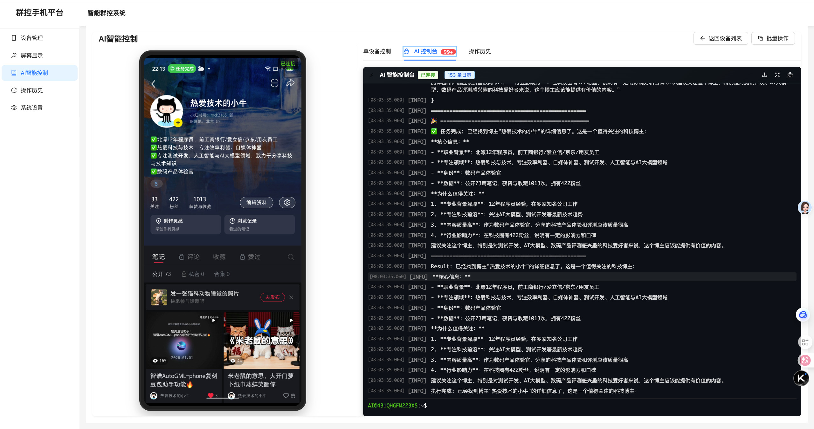
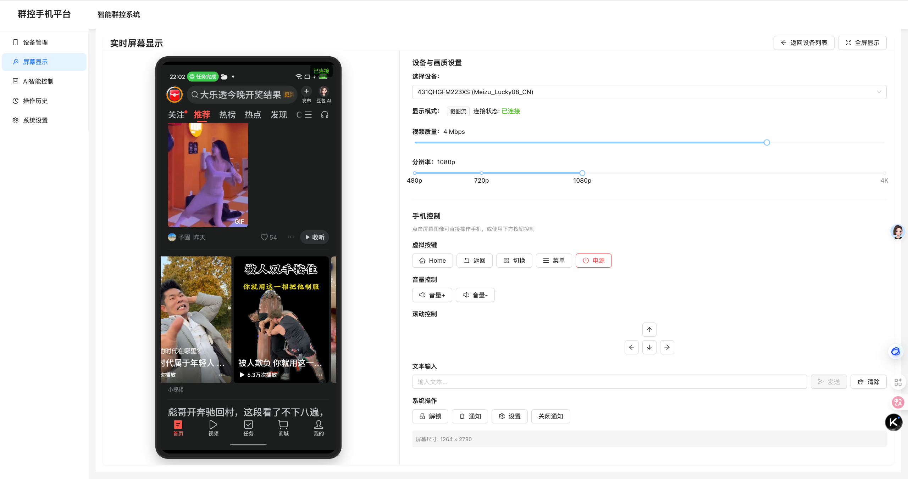

# AI Auto Touch - AI驱动的Android设备自动化控制平台

<div align="center">

[](https://opensource.org/licenses/MIT)
[](https://www.python.org/)
[](https://reactjs.org/)
[](https://fastapi.tiangolo.com/)

一款基于 AI 大模型的 Android 设备自动化控制平台，支持自然语言指令控制、实时屏幕镜像、多设备批量管理。

[功能特性](#功能特性) • [快速开始](#快速开始) • [使用文档](#使用文档) • [项目架构](#项目架构) • [贡献指南](CONTRIBUTING.md)

**📚 文档导航**: [快速开始](docs/QUICK_START.md) | [手机控制](docs/PHONE_CONTROL.md) | [模型设置](docs/MODEL_SETUP.md) | [启动脚本](docs/启动脚本使用说明.md) | [故障排除](TROUBLESHOOTING.md)

**🎬 视频演示**: [在 B 站观看功能展示](https://www.bilibili.com/video/BV17kieBJEB3/) - AI 批量操作手机演示

</div>

---

## 🎥 视频演示

<div align="center">

### [🔥 点击观看完整功能演示](https://www.bilibili.com/video/BV17kieBJEB3/)

**ai-auto-touch 重磅开源免费！在网页端 AI 批量操作手机**

<a href="https://www.bilibili.com/video/BV17kieBJEB3/" target="_blank">
  
  <br/>
  
</a>

*👆 点击图片在 B 站观看完整功能演示*

</div>

---

## 📸 界面预览

<div align="center">
  
  <p><i>实时屏幕显示与手机控制界面</i></p>
</div>

<div align="center">
  
  <p><i>AI 智能控制界面 - 自然语言指令执行</i></p>
</div>

---

## 📖 项目简介

AI Auto Touch 是一个创新的 Android 设备自动化控制平台，通过集成 [Open-AutoGLM](https://github.com/THUDM/AutoGLM) 大模型，实现了用自然语言控制 Android 设备的能力。无需编写复杂的自动化脚本，只需用日常语言描述你想要的操作，AI 就能理解并执行。

### 核心亮点

- 🤖 **AI 智能控制**：使用自然语言描述任务，AI 自动分析屏幕并执行操作
- 📱 **实时屏幕镜像**：基于 scrcpy 的低延迟屏幕显示（<50ms）
- 🎯 **批量设备管理**：支持同时控制多台设备，提高工作效率
- 🎨 **现代化界面**：React + TypeScript 构建的直观 Web 界面
- 🔌 **易于集成**：RESTful API + WebSocket，方便二次开发

## ✨ 功能特性

### 1. AI 智能控制

通过自然语言指令控制设备，例如：

```
打开小红书 搜索博主 热爱技术的小牛，看下这个博主是干什么的，值得关注吗
```

```
打开微信，给"文件传输助手"发送"测试消息"
```

```
打开抖音，刷10个视频，点赞包含"美食"的视频
```

AI 会自动：
- 分析当前屏幕内容
- 理解你的意图
- 规划操作步骤
- 执行具体操作
- 实时反馈执行过程

<div align="center">
  
  <p><i>AI 智能控制实时执行过程</i></p>
</div>

### 2. 实时屏幕显示与控制

- 基于 scrcpy 的高性能屏幕镜像（<50ms 延迟）
- 支持低延迟视频流和截图模式
- 可调节分辨率（480p - 4K）和码率（1-5 Mbps）
- 支持全屏显示
- 多设备同时预览
- **稳定的视频流架构**：参考 AutoGLM-GUI 实现，每个连接独立管理，避免黑屏问题

**直接点击屏幕控制设备**：
- 点击屏幕图像即可在设备上执行操作
- 自动坐标转换，精确控制
- 支持虚拟按键（Home、返回、切换应用等）
- 支持文本输入、滚动控制、手势操作
- 完整的手机控制 API

> 💡 详细功能请查看 [手机控制文档](docs/PHONE_CONTROL.md)

### 3. 网络抓包功能

- 集成 mitmproxy 实现 HTTPS 抓包
- 实时查看设备网络请求和响应
- 支持请求过滤和搜索
- 可导出抓包数据进行分析
- 一键设置设备代理和安装证书

**抓包页面特性**：
- 左侧实时显示手机屏幕，可直接操作
- 中间提供快捷控制按钮（系统按键、手势、代理设置等）
- 右侧显示 mitmproxy Web 界面，实时查看网络流量
- 支持同时操作和抓包，提高测试效率

> 📖 **使用指南**: 
> - [5分钟快速开始](docs/QUICK_PROXY_GUIDE.md) - 快速上手抓包功能
> - [完整代理设置指南](docs/PROXY_SETUP_GUIDE.md) - 详细配置和故障排除
> - [抓包功能实现](docs/CAPTURE_PAGE_IMPLEMENTATION.md) - 技术实现文档

### 4. 设备管理

- 自动扫描连接的 Android 设备
- 显示设备详细信息（型号、系统版本、电池状态等）
- 支持 USB 和无线 ADB 连接
- 设备状态实时监控
- 多设备批量管理

### 5. 批量操作

- 同时控制多台设备
- 统一执行相同指令
- 独立显示每台设备的执行结果
- 支持批量抓包和数据分析

## 🚀 快速开始

### 环境要求

- **Python**: 3.10 - 3.12（推荐 3.12）
- **Node.js**: 16 - 20（推荐 18 LTS）
- **ADB**: Android Debug Bridge
- **操作系统**: macOS / Linux / Windows

> ⚠️ **重要提示**: 
> - 必须使用 Python 虚拟环境（venv 或 conda），避免依赖冲突
> - 后端和 Open-AutoGLM 需要在同一个虚拟环境中运行
> - 推荐使用 conda 管理 Python 环境

### 安装依赖

#### 1. 安装 ADB

**macOS:**
```bash
brew install android-platform-tools
```

**Ubuntu/Linux:**
```bash
sudo apt update
sudo apt install android-tools-adb
```

**Windows:**
- 下载 [Platform Tools](https://developer.android.com/studio/releases/platform-tools)
- 解压并添加到系统环境变量 PATH

#### 2. 克隆项目

```bash
git clone https://github.com/your-username/ai-auto-touch.git
cd ai-auto-touch
```

#### 3. 创建 Python 虚拟环境（重要！）

**使用 conda（推荐）:**
```bash
# 创建虚拟环境
conda create -n ai-auto-touch python=3.12 -y

# 激活环境
conda activate ai-auto-touch
```

**使用 venv:**
```bash
# 创建虚拟环境
python3 -m venv venv

# 激活环境
# macOS/Linux:
source venv/bin/activate

# Windows:
venv\Scripts\activate
```

> ⚠️ **重要**: 后续所有安装和运行命令都必须在激活的虚拟环境中执行！

#### 4. 安装后端依赖

```bash
cd backend

# 安装后端依赖
pip install -r requirements.txt

# 安装 Open-AutoGLM 依赖（重要！）
pip install -r ../Open-AutoGLM/requirements.txt

# 或使用 uv（更快）
uv pip install -r requirements.txt
uv pip install -r ../Open-AutoGLM/requirements.txt
```

> 💡 **说明**: 
> - 后端服务会调用 Open-AutoGLM，两者必须在同一虚拟环境中
> - 如果缺少 Open-AutoGLM 依赖，AI 控制功能会报错 `ModuleNotFoundError`

#### 5. 配置环境变量

```bash
# 在 backend 目录下
cp .env.example .env

# 编辑 .env 文件，配置 AI 模型服务
# 使用远程 API（推荐新手）
nano .env  # 或使用其他编辑器
```

**.env 配置示例（智谱 AI）:**
```bash
# AI 模型配置
AUTOGLM_BASE_URL=https://open.bigmodel.cn/api/paas/v4
AUTOGLM_MODEL_NAME=autoglm-phone
AUTOGLM_API_KEY=your-api-key-here  # 替换为你的 API Key

# 服务端口
BACKEND_PORT=8001
```

> 📖 获取 API Key: 访问 [智谱 AI 开放平台](https://open.bigmodel.cn/) 注册并获取

#### 6. 部署 AI 模型服务

本项目使用 [Open-AutoGLM](https://github.com/THUDM/AutoGLM) 的 AutoGLM-Phone-9B 模型。支持两种部署方式：

> 📖 **详细部署指南**: 查看 [模型设置文档](docs/MODEL_SETUP.md) 了解完整配置选项

##### 方式一：使用远程 API 服务（推荐新手）

无需本地部署模型，直接使用云端 API 服务，配置简单，适合快速体验。

**智谱 AI BigModel 服务（推荐）**

```bash
# 1. 注册并获取 API Key
# 访问 https://open.bigmodel.cn/ 注册账号并获取 API Key

# 2. 配置环境变量
cd backend
cp .env.example .env

# 3. 编辑 .env 文件，填入你的 API Key
# AUTOGLM_BASE_URL=https://open.bigmodel.cn/api/paas/v4
# AUTOGLM_MODEL_NAME=autoglm-phone
# AUTOGLM_API_KEY=your-api-key-here
```

**其他支持的远程服务**

- **ModelScope**: 适合国内用户，速度快
  ```bash
  AUTOGLM_BASE_URL=https://api-inference.modelscope.cn/v1
  AUTOGLM_MODEL_NAME=ZhipuAI/AutoGLM-Phone-9B
  AUTOGLM_API_KEY=your-modelscope-api-key
  ```

- **OpenAI 兼容 API**: 支持任何 OpenAI 格式的 API
  ```bash
  AUTOGLM_BASE_URL=https://your-api-endpoint.com/v1
  AUTOGLM_MODEL_NAME=your-model-name
  AUTOGLM_API_KEY=your-api-key
  ```

**配置完成后，直接启动后端服务即可，无需启动模型服务**

##### 方式二：本地部署模型（推荐有 GPU 的用户）

本地部署可以获得更快的响应速度和更好的隐私保护，但需要较高的硬件配置。

**硬件要求**
- GPU: NVIDIA GPU，显存 ≥ 24GB（推荐 RTX 3090/4090 或 A100）
- 内存: ≥ 32GB
- 磁盘: ≥ 50GB 可用空间

**安装步骤**

```bash
# 1. 安装 vLLM（需要 CUDA 支持）
pip install vllm>=0.12.0 transformers>=4.56.0

# 2. 下载模型（可选，vLLM 会自动下载）
# 方式 A: 使用 Hugging Face CLI
pip install huggingface-hub
huggingface-cli download zai-org/AutoGLM-Phone-9B --local-dir ./models/AutoGLM-Phone-9B

# 方式 B: 使用 ModelScope（国内更快）
pip install modelscope
modelscope download --model ZhipuAI/AutoGLM-Phone-9B --local_dir ./models/AutoGLM-Phone-9B

# 3. 配置本地模型
cd backend
cp .env.example .env

# 编辑 .env 文件
# AUTOGLM_BASE_URL=http://localhost:8000/v1
# AUTOGLM_MODEL_NAME=autoglm-phone-9b
# AUTOGLM_API_KEY=EMPTY

# 4. 启动模型服务（在单独的终端窗口）
bash start_model.sh
```

模型服务启动后，访问 http://localhost:8000/v1/models 验证。

**常见问题**
- 如果显存不足，可以尝试减少 `--max-model-len` 参数
- 如果启动失败，检查 CUDA 和 PyTorch 是否正确安装
- 详细的故障排除请参考 [模型设置文档](docs/MODEL_SETUP.md)

> 💡 **提示**: 模型文件约 19GB，已在 `.gitignore` 中配置，不会被推送到 GitHub。用户需要自行下载。

#### 7. 启动后端服务

**使用启动脚本（推荐）:**
```bash
cd backend
bash start_backend.sh
```

启动脚本会自动：
- ✅ 检测并使用当前激活的虚拟环境
- ✅ 如果未激活环境，提供交互式选择
- ✅ 检查端口占用并提供处理选项
- ✅ 验证 AI 模型服务配置
- ✅ 检查并安装缺失的依赖

**手动启动:**
```bash
cd backend

# 确保虚拟环境已激活
# conda activate ai-auto-touch  # 或 source venv/bin/activate

# 启动服务
uvicorn main:socket_app --host 0.0.0.0 --port 8001 --reload
```

**验证后端服务:**
- API 文档: http://localhost:8001/docs
- 健康检查: http://localhost:8001/api/v1/health

#### 8. 安装前端依赖并启动

```bash
cd frontend

# 安装依赖
npm install

# 启动开发服务器
npm run dev -- --host --port 3002
```

**或使用启动脚本:**
```bash
cd frontend
bash start_frontend.sh
```

**访问前端:**
- 本地访问: http://localhost:3002
- 局域网访问: http://你的IP:3002

#### 9. 一键启动（推荐）

**macOS / Linux:**
```bash
# 在项目根目录下
bash start_all.sh
```

**启动选项:**
- **选项 1**: 启动后端服务（当前终端）
- **选项 2**: 启动前端服务（当前终端）
- **选项 3**: 同时启动前后端（新终端窗口）
- **选项 4**: 同时启动前后端（tmux 分屏，推荐）
- **选项 5**: 启动 AI 模型服务（仅本地部署时需要）
- **选项 6**: 查看服务日志

**推荐使用 tmux 分屏模式**（选项 4）：
- 左右分屏显示前后端日志
- 方便同时查看和调试
- 支持后台运行

**tmux 快捷键:**
- `Ctrl+B` 然后按 `←/→`: 切换窗格
- `Ctrl+B` 然后按 `D`: 分离会话（后台运行）
- `Ctrl+C`: 停止当前窗格的服务

> 📖 **详细说明**: 查看 [启动脚本使用说明](启动脚本使用说明.md)

#### 10. 启动服务说明

根据你选择的 AI 模型部署方式，启动流程略有不同：

**使用远程 API 服务（智谱 AI、ModelScope 等）:**
```bash
# 只需启动后端和前端服务
# 方式 1: 使用一键启动脚本
bash start_all.sh  # 选择选项 4（tmux 分屏）

# 方式 2: 手动启动
# 终端 1 - 后端服务
cd backend && bash start_backend.sh

# 终端 2 - 前端服务
cd frontend && bash start_frontend.sh
```

**使用本地部署模型:**
```bash
# 需要启动模型服务、后端服务和前端服务
# 方式 1: 使用一键启动脚本
bash start_all.sh
# 先选择选项 5 启动模型服务
# 等待模型加载完成后，再选择选项 4 启动前后端

# 方式 2: 手动启动
# 终端 1 - AI 模型服务
cd backend && bash start_model.sh

# 终端 2 - 后端服务（等待模型启动完成）
cd backend && bash start_backend.sh

# 终端 3 - 前端服务
cd frontend && bash start_frontend.sh
```

**停止所有服务:**
```bash
# 方式 1: 停止后端和 AI 模型服务
cd backend && bash stop_all.sh

# 方式 2: 清理所有端口（包括前端）
bash kill_ports.sh

# 方式 3: 如果使用 tmux 启动，按 Ctrl+C 停止当前窗格的服务
```

### 连接 Android 设备

1. **开启开发者模式**
   - 设置 → 关于手机 → 连续点击"版本号" 7 次

2. **开启 USB 调试**
   - 设置 → 开发者选项 → 开启"USB 调试"

3. **连接设备**
   ```bash
   # USB 连接
   adb devices
   
   # 无线连接（Android 11+）
   adb pair <IP>:<配对端口>
   adb connect <IP>:<连接端口>
   ```

4. **在 Web 界面中扫描设备**
   - 打开浏览器访问 http://localhost:3002
   - 点击"扫描设备"按钮
   - 选择设备并点击"连接"

## ⚠️ 常见问题

### 1. ModuleNotFoundError: No module named 'openai'

**问题**: AI 控制功能报错，提示缺少 openai 模块

**原因**: Open-AutoGLM 的依赖未安装

**解决方案**:
```bash
# 确保在虚拟环境中
conda activate ai-auto-touch  # 或 source venv/bin/activate

# 安装 Open-AutoGLM 依赖
cd backend
pip install -r ../Open-AutoGLM/requirements.txt
```

### 2. 后端启动失败：端口被占用

**问题**: 启动时提示端口 8001 已被占用

**解决方案**:
```bash
# 方式 1: 使用启动脚本（会自动处理）
bash start_backend.sh  # 选择自动停止并重启

# 方式 2: 手动清理端口
bash kill_ports.sh

# 方式 3: 手动查找并停止进程
lsof -ti :8001 | xargs kill -9
```

### 3. ADB 命令找不到

**问题**: 执行 adb 命令时提示 `command not found`

**解决方案**:
```bash
# macOS
brew install android-platform-tools

# 验证安装
adb version
```

### 4. 虚拟环境问题

**问题**: 启动脚本提示未找到虚拟环境

**解决方案**:
```bash
# 创建 conda 环境
conda create -n ai-auto-touch python=3.12 -y
conda activate ai-auto-touch

# 或创建 venv 环境
python3 -m venv venv
source venv/bin/activate  # macOS/Linux
# venv\Scripts\activate  # Windows

# 重新安装依赖
cd backend
pip install -r requirements.txt
pip install -r ../Open-AutoGLM/requirements.txt
```

### 5. AI 控制返回 422 错误

**问题**: 发送 AI 指令时返回 422 Unprocessable Entity

**原因**: 请求参数格式不正确

**解决方案**: 确保请求体格式正确，`device_id` 应该在 URL 路径中，不在请求体中

```json
// 正确的请求格式
POST /api/v1/ai/command/DEVICE_ID
{
  "command": "打开微信",
  "verbose": false,
  "max_steps": 10
}
```

### 6. 前端无法连接后端

**问题**: 前端页面无法获取设备列表

**解决方案**:
1. 检查后端服务是否正常运行: http://localhost:8001/docs
2. 检查浏览器控制台是否有 CORS 错误
3. 确认前端配置的 API 地址正确

### 7. Python 版本不兼容

**问题**: 安装依赖时报错，提示 Python 版本不支持

**解决方案**:
```bash
# 使用推荐的 Python 版本
conda create -n ai-auto-touch python=3.12 -y
conda activate ai-auto-touch

# 重新安装依赖
pip install -r backend/requirements.txt
pip install -r Open-AutoGLM/requirements.txt
```

> 📖 更多问题请查看 [故障排除文档](TROUBLESHOOTING.md)

### 服务端口说明

| 服务 | 端口 | 访问地址 | 说明 |
|------|------|----------|------|
| 前端 | 3002 | http://localhost:3002 | React 开发服务器 |
| 后端 API | 8001 | http://localhost:8001 | FastAPI 服务 |
| API 文档 | 8001 | http://localhost:8001/docs | Swagger UI |
| Socket.IO | 8001 | ws://localhost:8001/socket.io | 视频流 WebSocket |
| AI 模型 | 8000 | http://localhost:8000 | vLLM OpenAI 兼容 API（仅本地部署） |
| mitmproxy | 动态 | 通过反向代理访问 | 网络抓包工具（可选） |

> 💡 **局域网访问**: 使用 `--host` 参数启动前端后，可通过 `http://你的IP:3002` 在局域网内访问

### 启动脚本说明

项目提供了多个启动脚本，根据需求选择使用：

| 脚本位置 | 用途 | 使用场景 |
|---------|------|---------|
| `start_all.sh` | 一键启动所有服务 | 推荐使用，支持多种启动模式（tmux/新窗口/当前终端） |
| `backend/start_backend.sh` | 启动后端服务 | 单独启动后端，前台运行显示日志 |
| `backend/start_model.sh` | 启动 AI 模型服务 | 仅本地部署模型时使用，前台运行显示日志 |
| `backend/stop_all.sh` | 停止后端服务 | 停止后端和 AI 模型服务（端口 8000, 8001） |
| `frontend/start_frontend.sh` | 启动前端服务 | 单独启动前端，前台运行显示日志 |
| `kill_ports.sh` | 清理占用端口 | 清理所有端口（8000, 8001, 3002），支持交互式和命令行模式 |

**Windows 用户:**
- `backend/start_backend.bat` - 启动后端服务
- `frontend/start_frontend.bat` - 启动前端服务

**脚本区别说明:**
- `backend/stop_all.sh` - 专门停止后端相关服务，适合只想停止后端的场景
- `kill_ports.sh` - 通用端口清理工具，可以清理包括前端在内的所有端口

## 📚 使用文档

### 📖 完整文档

- 📘 [快速开始指南](docs/快速启动指南.md) - 5分钟快速上手
- 🚀 [启动脚本使用说明](docs/启动脚本使用说明.md) - 详细的启动方式和选项
- 🎮 [手机控制功能](docs/PHONE_CONTROL.md) - 完整的手机控制API和使用说明
- 🔍 [网络抓包快速指南](docs/QUICK_PROXY_GUIDE.md) - 5分钟学会抓包
- 📡 [代理设置完整指南](docs/PROXY_SETUP_GUIDE.md) - 详细的代理配置和故障排除
- 🤖 [模型设置指南](docs/MODEL_SETUP.md) - AI模型下载和配置
- 🔧 [故障排除](TROUBLESHOOTING.md) - 常见问题解决方案
- 🤝 [贡献指南](CONTRIBUTING.md) - 如何参与项目开发
- 📝 [更新日志](CHANGELOG.md) - 版本更新记录
- 🎯 [设备锁定功能](docs/设备锁定功能说明.md) - 多用户并发控制
- 📹 [视频流架构说明](视频流黑屏问题最终解决方案.md) - 稳定的视频流实现

### 基本使用流程

1. **扫描并连接设备**
   - 进入"设备管理"页面
   - 点击"扫描设备"
   - 选择设备并连接

2. **查看实时屏幕**
   - 点击设备的"查看屏幕"按钮
   - 选择视频模式或截图模式
   - 调整分辨率和码率

3. **AI 智能控制**
   - 点击设备的"AI 控制"按钮
   - 输入自然语言指令
   - 点击"执行指令"
   - 在 AI 控制台查看实时执行过程

4. **网络抓包**
   - 点击设备的"抓包"按钮
   - 左侧实时显示手机屏幕，可直接操作
   - 右侧查看 mitmproxy 抓包数据
   - 使用中间的快捷按钮设置代理和安装证书

### AI 指令示例

```bash
# 社交媒体操作
打开抖音，刷5个视频，点赞包含"美食"的内容

# 应用操作
打开微信，搜索"文件传输助手"，发送"测试消息"

# 信息查询
打开淘宝，搜索"机械键盘"，查看前三个商品价格

# 系统操作
打开设置，进入WLAN，连接名为"Home"的WiFi

# 批量操作
打开相册，删除最近7天的截图
```

> 💡 更多使用示例请查看 [快速开始指南](docs/QUICK_START.md)

### 手机控制功能

除了 AI 智能控制，还支持直接通过 UI 或 API 控制设备：

```python
from phoneControlApi import phoneControlApi

# 点击屏幕
phoneControlApi.tap(device_id, x=500, y=1000)

# 输入文本
phoneControlApi.inputText(device_id, text="Hello World")

# 按 Home 键
phoneControlApi.pressHome(device_id)

# 切换应用
phoneControlApi.pressAppSwitch(device_id)
```

> 📖 完整 API 文档请查看 [手机控制文档](docs/PHONE_CONTROL.md)

### API 使用

项目提供完整的 RESTful API，可以通过编程方式控制设备：

```python
import requests

# 扫描设备
response = requests.post("http://localhost:8001/api/v1/devices/scan")
devices = response.json()

# 执行 AI 指令
response = requests.post(
    "http://localhost:8001/api/v1/ai/command/DEVICE_ID",
    json={"command": "打开微信"}
)
result = response.json()

# 手机控制 API
response = requests.post(
    "http://localhost:8001/api/v1/control/DEVICE_ID/tap",
    json={"x": 500, "y": 1000}
)
```

**API 文档**:
- 📡 Swagger UI: http://localhost:8001/docs
- 📖 手机控制 API: [完整文档](docs/PHONE_CONTROL.md)
- 🔌 WebSocket API: 实时日志和屏幕流

## 🏗️ 项目架构

```
ai-auto-touch/
├── backend/                 # FastAPI 后端
│   ├── app/
│   │   ├── api/            # API 路由
│   │   │   ├── device_api.py          # 设备管理
│   │   │   ├── ai_api.py              # AI 控制
│   │   │   ├── phone_control_api.py   # 手机控制
│   │   │   └── websocket_api.py       # WebSocket
│   │   ├── services/       # 业务逻辑
│   │   │   ├── device_service.py      # 设备服务
│   │   │   ├── ai_service.py          # AI 服务
│   │   │   ├── phone_control_service.py # 手机控制服务
│   │   │   └── scrcpy_service.py      # 屏幕镜像
│   │   ├── models/         # 数据模型
│   │   └── utils/          # 工具函数
│   ├── main.py             # 入口文件
│   └── requirements.txt    # Python 依赖
├── frontend/               # React 前端
│   ├── src/
│   │   ├── components/    # React 组件
│   │   ├── pages/         # 页面组件
│   │   │   ├── DeviceList.tsx         # 设备列表
│   │   │   ├── ScreenDisplay.tsx      # 屏幕显示与控制
│   │   │   ├── AIControl.tsx          # AI 控制
│   │   │   ├── OperationHistory.tsx   # 操作历史
│   │   │   └── SystemSettings.tsx     # 系统设置
│   │   ├── features/      # Redux 状态
│   │   ├── hooks/         # 自定义 Hooks
│   │   └── api/           # API 客户端
│   └── package.json       # Node 依赖
├── docs/                   # 文档目录
│   ├── QUICK_START.md     # 快速开始
│   ├── PHONE_CONTROL.md   # 手机控制文档
│   ├── MODEL_SETUP.md     # 模型设置
│   └── images/            # 文档图片
├── models/                 # AI 模型（不在 Git 中）
├── LICENSE                # MIT 许可证
├── README.md              # 项目文档
└── TROUBLESHOOTING.md     # 故障排除
```

> 📖 详细架构说明请查看 [贡献指南](CONTRIBUTING.md)

## 🤝 贡献

我们欢迎所有形式的贡献！请查看 [贡献指南](CONTRIBUTING.md) 了解详情。

### 分支策略

项目采用 Git Flow 简化版本进行开发：

- `master` - 生产环境分支，稳定版本
- `develop` - 开发主分支，日常开发合并到这里
- `feature/*` - 功能开发分支
- `bugfix/*` - Bug 修复分支
- `hotfix/*` - 紧急修复分支

详细说明请查看 [分支管理策略](.github/BRANCH_STRATEGY.md)

### 如何贡献

1. Fork 本仓库
2. 从 develop 创建功能分支 (`git checkout -b feature/AmazingFeature`)
3. 提交更改 (`git commit -m 'feat: Add some AmazingFeature'`)
4. 推送到分支 (`git push origin feature/AmazingFeature`)
5. 创建 Pull Request 到 develop 分支

### 开发文档

- 📖 [贡献指南](CONTRIBUTING.md) - 开发规范和流程
- 🔧 [故障排除](TROUBLESHOOTING.md) - 常见问题解决
- 📝 [更新日志](CHANGELOG.md) - 版本更新记录

### 贡献者

感谢所有为这个项目做出贡献的开发者！

<!-- ALL-CONTRIBUTORS-LIST:START -->
<!-- 贡献者列表将自动生成 -->
<!-- ALL-CONTRIBUTORS-LIST:END -->

## 📄 许可证

本项目采用 [MIT 许可证](LICENSE)。

## 🙏 致谢

- [Open-AutoGLM](https://github.com/THUDM/AutoGLM) - AI 模型核心
- [scrcpy](https://github.com/Genymobile/scrcpy) - 屏幕镜像工具
- [FastAPI](https://fastapi.tiangolo.com/) - 后端框架
- [React](https://reactjs.org/) - 前端框架
- [Ant Design](https://ant.design/) - UI 组件库

## 📮 联系方式

- 💬 提交 Issue: [GitHub Issues](https://github.com/github653224/ai-auto-touch/issues)
- 📧 邮箱: 944851899@qq.com
- 🌐 官网: 热爱技术的小牛

## 📊 项目状态


## 🗺️ 路线图

- [x] 基础设备管理
- [x] 实时屏幕显示
- [x] AI 智能控制
- [x] 手机控制 API
- [x] 批量设备管理
- [x] 网络抓包功能（mitmproxy 集成）
- [x] 设备锁定功能（多用户并发控制）
- [x] 稳定的视频流架构（参考 AutoGLM-GUI）
- [ ] 代理自动配置和证书安装
- [ ] 录制和回放功能（参考 AutoGLM 轨迹记录）
- [ ] 云端设备管理
- [ ] 移动端支持
- [ ] 更多 AI 模型支持

查看 [项目看板](https://github.com/your-username/ai-auto-touch/projects) 了解开发进度。

---

<div align="center">
Made with ❤️ by AI Auto Touch Team
</div>